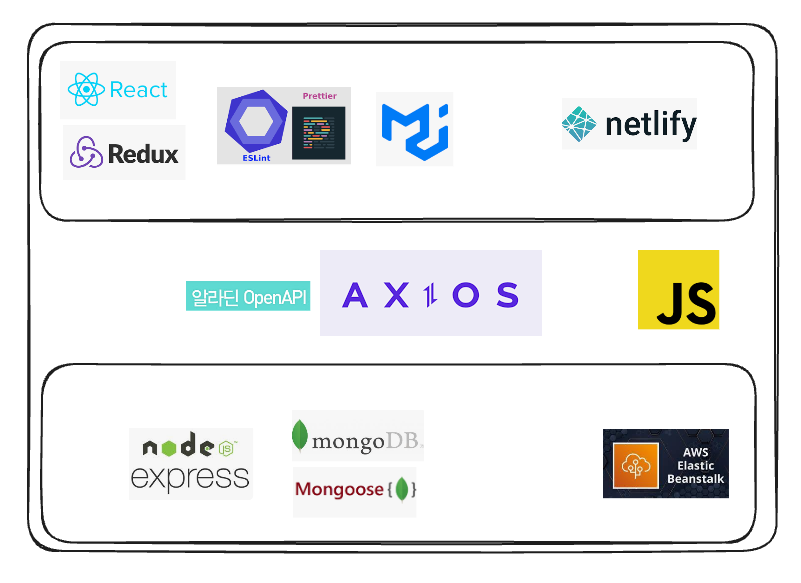

# 🏆 97.1K YouTube Competition 2rd Place Winner 🏆

**🏆 97.1K YouTube Competition 2rd Place Winner 🏆**  
[Link to the YouTube Channel](https://youtu.be/I4eYyL9HfsY?si=CaevphThfB3XQkMy)

## Table of Contents
- [👀 Project Introduction](#project-introduction)
- [👨‍👩‍👧‍👦 Team Introduction](#team-introduction)
- [🛠 Tech Stack](#tech-stack)
- [🔁 Flow](#flow)
- [💻 Features & Screens](#features--screens)

## BookDo7Stars

### 👥 Team Introduction
| Member |        Role        |                  Responsibilities                  |                 GitHub                  |
| :----: | :----------------: | :-----------------------------------------------: | :-------------------------------------: |
| Geunseon | Project Owner  | My Page, Admin Product Management, Order Management | [geunseonkim](https://github.com/geunseonkim) |
| Hyoan |   Scrum Master    | Cart, Payment, Admin Dashboard | [HyoanMoon](https://github.com/HyoanMoon) |
| May |        Member        | Main Banner, Footer, Integrated Search, Search Results Page, Login/Sign Up, Detail Page, Contact Page | [MayHyeyeonKim](https://github.com/MayHyeyeonKim) |
| Hunjoon  |        Member        | Main, GitHub, Database, Category, Header, Navbar, Book Card, Filter, Search | [hunjoonrhee](https://github.com/hunjoonrhee) |

### Project Introduction
<table>
  <tr>
    <td>
      
    </td>
    <td>
      - URL <a href="https://book-do-7-stars.netlify.app/" target="_blank">Go to Site</a> 
      - Figma <a href="https://www.figma.com/board/zrp9Df7zWs9mTP8ZsAxFiC/7CodeCrew?node-id=0-1&t=JvYN792QJ4msDyGj-0" target="_blank">View on Figma</a>
    </td>
  </tr>
</table>

#### 🗓️ Development Period & Approach

- Development Period: 2024.06.16 ~ 2024.06.30
- Approach: Stand-up Meetings, 2-week sprint

#### ⛏ Tech Stack & Environment

<!-- ### Service Introduction

#### Topic

## 📱 Implementation (Mobile Version)

### Category & Search Page

### Detail Page

## 🖥️ Responsive Design (Desktop Version) -->
